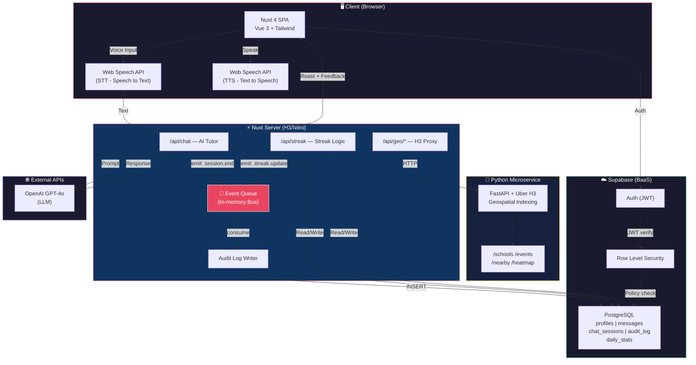
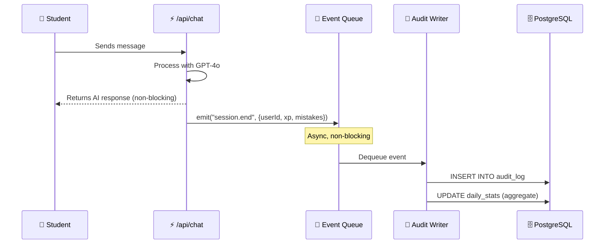
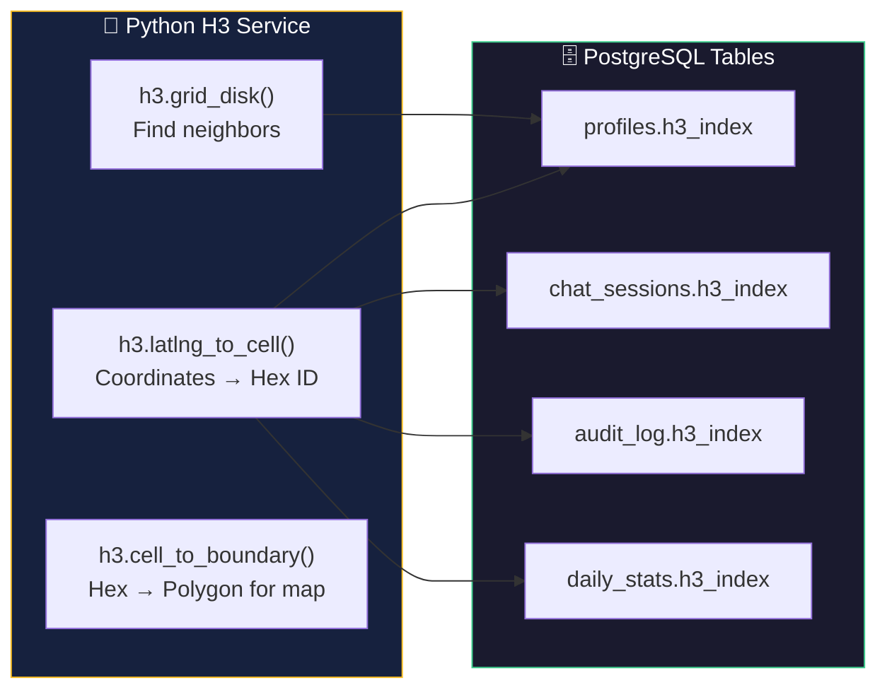

# 2. Architecture Overview — Tayaq.ai

## Architecture Diagram



---

## Architectural Choice: Modular Monolith + 1 Microservice

We use a **Modular Monolith** (Nuxt/Nitro handles both frontend and backend) with **one dedicated Python Microservice** for geospatial indexing:

| Component | Type | Why |
|---|---|---|
| Nuxt 4 (frontend + backend) | **Monolith** | Single deploy, SSR + API routes in one process |
| Python H3 Service | **Microservice** | H3 is a Python/C library — cannot run in Node.js |

### Justification

**Why not full Microservices?**
- We are a team of 2–3 people. Microservices add overhead: service discovery, distributed tracing, DevOps complexity
- We have ~5 API endpoints — this is not Netflix-scale
- Nuxt/Nitro gives us SSR + API server + event handling in a single process

**Why not a pure Monolith?**
- Uber H3 (geospatial indexing) is written in C with production-ready Python bindings only
- Geospatial logic has a fundamentally different responsibility than language learning
- Allows independent scaling of the H3 service when user base grows

**Conclusion:** Monolith for development speed + microservice where technically required (Python H3).

---

## Event-Driven Component: Audit Event Queue

Our architecture includes an **event-driven component** — an in-memory event bus inside the Nitro server:



### How it works:

1. The **API endpoint** handles the user request synchronously and returns a response
2. After responding, the endpoint **emits** an event to the queue (async, fire-and-forget)
3. The **Audit Writer** subscribes to the queue — it writes to `audit_log` and updates `daily_stats`
4. The user **does not wait** for the audit write — the response arrives instantly

**Event types:**

| Event | Trigger | Data |
|---|---|---|
| `session.start` | AI chat begins | userId, roastLevel, h3_index |
| `session.end` | AI chat ends | userId, xpEarned, mistakesFound |
| `streak.update` | User logs in | userId, oldStreak, newStreak |
| `message.send` | DM sent | senderId, receiverId |
| `profile.update` | City changed | userId, oldCity, newCity |

---

## Failure Handling

| Failure | Likelihood | Strategy |
|---|---|---|
| **OpenAI API down** | Medium | Retry 3× with exponential backoff → graceful error: "AI tutor is resting, try again in a minute" → streak is preserved |
| **Supabase DB down** | Low | Retry → fallback to localStorage for caching streak → sync on recovery |
| **Python H3 Service down** | Low | Graceful degradation: map shows last cached data, community works without H3 |
| **Event Queue failure** | Very Low | Dead Letter Queue → events are never lost, reprocessed later |
| **Auth token expired** | Frequent | Auto-refresh via Supabase SDK → if impossible, redirect to /login |

### Example: Retry + Fallback for OpenAI

```typescript
// server/api/chat.post.ts — failure handling
async function callOpenAI(prompt: string, retries = 3): Promise<string> {
  for (let i = 0; i < retries; i++) {
    try {
      const response = await openai.chat.completions.create({ ... });
      return response.choices[0].message.content;
    } catch (err) {
      if (i === retries - 1) {
        // Final retry failed → graceful fallback
        return "⚠️ AI tutor is temporarily unavailable. Your streak is safe!";
      }
      // Exponential backoff: 1s → 2s → 4s
      await new Promise(r => setTimeout(r, 1000 * Math.pow(2, i)));
    }
  }
}
```

---

## H3 in the Architecture — Where and How

### Where H3 is used



### How H3 is integrated across layers

| Layer | Component | H3 Function | Example |
|---|---|---|---|
| **Python Service** | `POST /index-location` | `latlng_to_cell(lat, lng, 7)` | 43.24, 76.94 → `"872d4b..."` |
| **Python Service** | `GET /nearby` | `grid_disk(cell, k)` | Find all students within 2-hex radius |
| **Python Service** | `GET /heatmap` | `cell_to_boundary(cell)` | Polygons for map visualization |
| **Nuxt Proxy** | `GET /api/geo/schools` | Proxy → Python | Frontend receives schools with hex IDs |
| **PostgreSQL** | `profiles.h3_index` | `WHERE h3_index IN (...)` | O(1) lookup via string index |
| **Analytics** | `daily_stats.h3_index` | `GROUP BY h3_index` | Per-district statistics |

### Data flow with H3

```
1. User selects city "Almaty"
2. Nuxt sends coordinates → Python H3 Service
3. Python: h3.latlng_to_cell(43.24, 76.94, 7) → "872d4b..."
4. Hex ID is stored in profiles.h3_index
5. Community page: SELECT * FROM profiles WHERE h3_index IN (neighbors)
6. Map page: Python computes boundaries → frontend draws hex polygons
```

### Why Resolution 7?

| Resolution | Hex Area | Best For |
|---|---|---|
| 5 | ~252 km² | Region / province |
| **7** | **~5.16 km²** | **City district ✅** |
| 9 | ~0.1 km² | Single city block |

**Resolution 7** covers ~5 km² per hexagon — ideal for finding nearby learners in urban areas across Kazakhstan cities like Almaty, Astana, and Shymkent.
