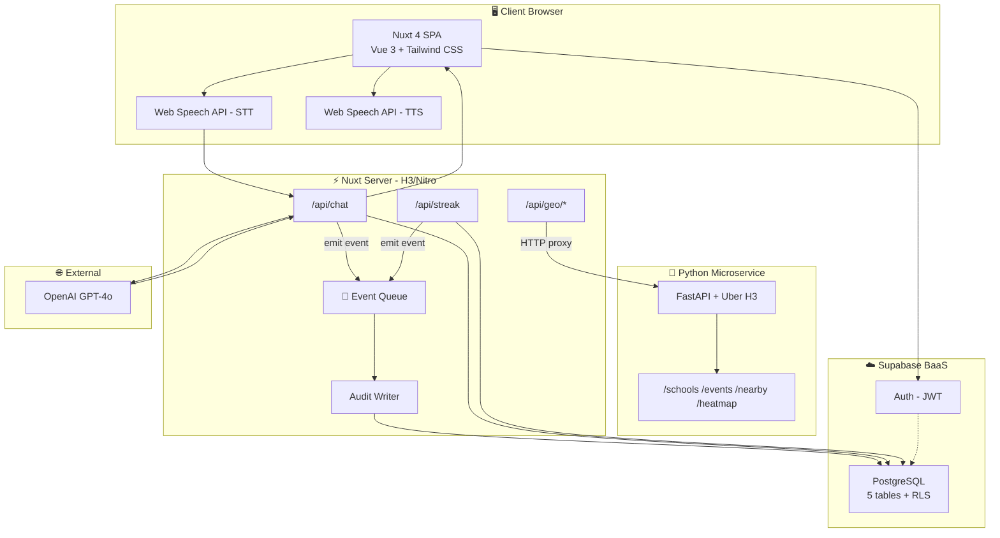
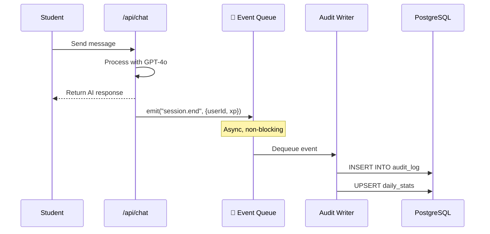

# INF 395 — 1st Assignment Report
## Tayaq.ai — AI-Powered English Learning Platform
### Team: [Your Team Name]

---

# Phase 1 — Main Project Kickoff

## Team Members & Roles

| Member | Role | Responsibilities |
|---|---|---|
| Aman (Zumagali) | Team Lead / Full-Stack Developer | Project architecture, Nuxt 4 frontend, Supabase integration, deployment |
| [Member 2] | Backend Developer | Python H3 service, FastAPI endpoints, database design |
| [Member 3] | AI/ML Engineer | OpenAI integration, speech pipeline (STT → LLM → TTS), persona system |

## Project Domain / Problem

**Domain:** Education Technology (EdTech)

**Problem:** In Kazakhstan, English proficiency is critical for career advancement, yet traditional language learning is expensive, boring, and lacks personalization. Students in smaller cities have limited access to quality English tutors. Existing platforms like Duolingo are generic and don't account for local cultural context.

**Our Solution:** Tayaq.ai — an AI English tutor that uses a sarcastic Kazakh persona to make learning engaging through "roast-based" grammar correction. It combines voice interaction (Speech-to-Speech), community features for local meetups, and geospatial indexing (H3) to connect learners by proximity.

## Scope and Main Goals

1. Build a voice-based AI English tutor with real-time speech processing
2. Implement gamification (XP, streaks, leaderboard) to maintain engagement
3. Connect learners geographically using Uber H3 hexagonal indexing
4. Enable community features (messaging, nearby learners, meetup coordination)
5. Deploy as a web application accessible from any device

## Expected Outputs / Outcomes

| Output | Description |
|---|---|
| Web Application | Nuxt 4 SPA with SSR, accessible at tayaq.ai |
| AI Tutor | GPT-4o powered persona with age-calibrated roast intensity |
| Voice Pipeline | Browser-based STT → OpenAI → TTS for voice interaction |
| Community System | Direct messaging + nearby learner discovery via H3 |
| Python Microservice | FastAPI + Uber H3 for geospatial indexing |
| Analytics Dashboard | Pre-aggregated daily stats by city and H3 hex cell |

## Challenges / Constraints

| Challenge | Mitigation |
|---|---|
| OpenAI API latency (~1-2s per response) | Streaming responses, typing indicators |
| Kazakh language STT accuracy is low | Start with English STT, add Kazakh progressively |
| Small team (2-3 devs) | Monolith architecture to reduce DevOps overhead |
| Supabase free tier limits | Efficient queries, aggregated tables to minimize scans |
| H3 is Python-only (no Node.js bindings) | Separate Python microservice, proxied via Nuxt |

## 14-Week Implementation Plan

| Week | Phase | Deliverable |
|---|---|---|
| 1–2 | Planning & Setup | Project scaffold, Supabase setup, design system |
| 3–4 | Core AI Tutor | OpenAI integration, persona system, chat UI |
| 5–6 | Voice Pipeline | Web Speech API (STT + TTS), streaming responses |
| 7–8 | Auth & Profiles | Supabase Auth, profile page, streak system |
| 9–10 | Community | Messaging, community page, city-based discovery |
| 11–12 | H3 Geospatial | Python H3 service, map page, heatmaps, nearby search |
| 13 | Security & Polish | RLS policies, audit logging, ABAC rules, UI polish |
| 14 | Testing & Defense | End-to-end testing, demo preparation, report writing |

---

# Phase 2 — Institutional Information System

---

## 1. System Framing

### 1.1 Institutional Problem

Kazakhstan's educational institutions face a critical gap: **English proficiency is required for employment and academic advancement, but quality tutoring is geographically concentrated in Almaty and Astana.** Students in Karaganda, Shymkent, Taraz, and smaller cities lack access to personalized English instruction.

Existing solutions fail because:
- **Private tutors** cost 5,000–15,000 KZT/hour — unaffordable for most students
- **Online platforms** (Duolingo, etc.) are generic, not adapted to Kazakh learners
- **University courses** are overcrowded with 30+ students per class
- **No system** connects learners for peer practice

Tayaq.ai addresses this by providing AI-powered tutoring accessible from any device, combined with geospatial community features that enable real-world meetups.

### 1.2 Stakeholder Analysis

| Stakeholder | Role | Power | Risk |
|---|---|---|---|
| **Students** | End users — learn English via AI tutor, message peers | Medium — can switch to competitors, influence via reviews | Data breach exposing personal info; incorrect AI feedback; streak loss |
| **Universities / Schools** | Partners — integrate Tayaq.ai into curriculum | High — drive mass adoption | Platform instability; content not aligned with academic standards |
| **Development Team** | Creators — build and maintain the platform | High — control technical decisions | Technical debt; burnout; loss of key developers |
| **OpenAI (API Provider)** | Supplier — provides GPT-4o for response generation | High — single provider of critical service | Price changes; API downtime; ToS changes; content censorship |
| **Supabase (BaaS)** | Infrastructure — database, auth, storage | Medium — can migrate to alternative | Downtime; data loss; free tier limit changes |
| **Investors** | Funding — provide resources for growth | High — influence strategic decisions | Insufficient monetization; no product-market fit |
| **Ministry of Education RK** | Regulator — sets educational standards | Medium — may require certification | Non-compliance with regulations; content blocking |
| **Content Moderators** | Safety — monitor community messages | Low — can be automated | Missed offensive content; false positives |

### 1.3 System Boundaries

**In scope:**
- AI-powered English tutoring (text + voice)
- User authentication and profiles
- Gamification (XP, streaks, leaderboard)
- Community messaging and nearby learner discovery
- Geospatial indexing via H3
- Audit logging and analytics

**Out of scope:**
- Payment/subscription system (future phase)
- Mobile native apps (web-only for MVP)
- Kazakh language STT (English-only for now)
- Content moderation AI (manual for MVP)

### 1.4 Critical Failure Scenario

> **Scenario:** OpenAI API fails during an active voice learning session

**Sequence:**
1. Student starts a voice session with the AI tutor
2. Student's speech is converted to text (STT) and sent to `/api/chat`
3. Server forwards the prompt to OpenAI GPT-4o
4. **OpenAI returns HTTP 503 (Service Unavailable)** after 30-second timeout
5. Student receives no grammar feedback
6. XP is not awarded, session data is incomplete
7. If this is the student's only activity today, their streak may be lost

**Impact Assessment:**

| Impact Area | Severity | Description |
|---|---|---|
| User Experience | 🔴 High | Student gets no response, loses trust |
| Data Integrity | 🟡 Medium | Incomplete session record in database |
| Gamification | 🟡 Medium | Streak may reset unfairly |
| Revenue | 🟢 Low | Wasted API tokens |

**Mitigation:**
- Retry 3× with exponential backoff (1s → 2s → 4s)
- Graceful fallback message: "AI tutor is temporarily unavailable. Your streak is safe!"
- Streak is not reset on system errors (only on genuine inactivity)
- Audit log records the failure for debugging
- Event queue ensures the session is properly closed even on failure

---

## 2. Architecture Overview

### 2.1 Architecture Diagram



### 2.2 Architecture Choice & Justification

**Choice: Modular Monolith + 1 Microservice**

| Component | Type | Justification |
|---|---|---|
| Nuxt 4 (frontend + API) | Monolith | Single deployment, SSR + API in one process. Ideal for a 2–3 person team |
| Python H3 Service | Microservice | H3 library is C-based with Python bindings only — cannot run in Node.js |

**Why not full Microservices?**
- Team of 2–3 people — microservices add DevOps overhead (service discovery, distributed tracing, container orchestration)
- Only ~5 API endpoints — this is not Netflix-scale
- Nuxt/Nitro provides SSR + API + event handling in a single process

**Why not pure Monolith?**
- H3 geospatial indexing requires Python (C bindings)
- Geospatial logic is a fundamentally different concern than language learning
- Allows independent scaling of H3 service as user base grows

### 2.3 Event-Driven Component

**Component:** In-memory Event Queue (Audit Bus)



**How it works:**
1. API endpoint handles the user request and returns a response (synchronous)
2. After responding, the endpoint emits an event to the queue (async, fire-and-forget)
3. The Audit Writer consumes events and writes to `audit_log` + updates `daily_stats`
4. The user does not wait for audit writes — response is instant

**Event types:** `session.start`, `session.end`, `streak.update`, `message.send`, `profile.update`

### 2.4 Failure Handling

| Failure | Strategy |
|---|---|
| OpenAI API down | Retry 3× with exponential backoff → graceful error message → streak preserved |
| Supabase DB down | Retry → localStorage fallback for streak → sync on recovery |
| Python H3 down | Graceful degradation: map shows cached data, community works without spatial search |
| Event Queue failure | Dead Letter Queue → events reprocessed later, never lost |
| Auth token expired | Auto-refresh via Supabase SDK → redirect to /login if impossible |

### 2.5 H3 in Architecture

H3 is integrated as a **dedicated Python microservice** that provides geospatial indexing:

| Layer | How H3 is Used |
|---|---|
| **Python Service** | Converts lat/lng → hex cell IDs, finds neighboring cells, generates hex boundaries for maps |
| **Nuxt Proxy** | `/api/geo/*` routes proxy requests to Python service |
| **PostgreSQL** | `h3_index` TEXT column in 4 tables enables O(1) spatial queries |
| **Frontend** | Map page renders hexagonal polygons from H3 cell boundaries |

**Why H3?** O(1) spatial lookup using string comparison (`WHERE h3_index IN (...)`) instead of O(n) distance calculations. No PostGIS extension required — works with plain TEXT columns on Supabase.

---

## 3. Data Modeling

### 3.1 ER Diagram

```mermaid
erDiagram
    USER ||--|| PROFILE : has
    USER ||--o{ MESSAGE : sends
    USER ||--o{ MESSAGE : receives
    USER ||--o{ CHAT_SESSION : starts
    CHAT_SESSION ||--o{ AUDIT_LOG : generates
    PROFILE ||--o{ DAILY_STATS : aggregated_into

    USER {
        uuid id PK
        text email
        jsonb raw_user_meta_data
        timestamptz created_at
    }

    PROFILE {
        uuid id PK_FK
        text username
        text city
        text bio
        int total_xp
        int streak_days
        int total_roasts
        float lat
        float lng
        text h3_index
    }

    MESSAGE {
        uuid id PK
        uuid sender_id FK
        uuid receiver_id FK
        text content
        bool read
        timestamptz created_at
    }

    CHAT_SESSION {
        uuid id PK
        uuid user_id FK
        int roast_level
        text h3_index
        int messages_count
        int xp_earned
    }

    AUDIT_LOG {
        uuid id PK
        uuid user_id FK
        text action
        text entity_type
        jsonb old_data
        jsonb new_data
        text h3_index
    }

    DAILY_STATS {
        uuid id PK
        date stat_date
        text city
        text h3_index
        int active_users
        int messages_sent
        int total_xp_earned
    }
```

### 3.2 Logical Schema

**Table 1: `profiles`** — User profiles with geospatial indexing

| Column | Type | Constraint | Description |
|---|---|---|---|
| id | UUID | PK, FK → auth.users | Supabase user ID |
| username | TEXT | | Display name |
| avatar_url | TEXT | | Profile picture |
| city | TEXT | | User's city |
| bio | TEXT | | Short bio |
| total_xp | INTEGER | DEFAULT 0 | Experience points |
| streak_days | INTEGER | DEFAULT 0 | Login streak |
| total_roasts | INTEGER | DEFAULT 0 | Grammar corrections survived |
| last_login_at | DATE | DEFAULT CURRENT_DATE | Last active date |
| lat | DOUBLE PRECISION | | Latitude |
| lng | DOUBLE PRECISION | | Longitude |
| **h3_index** | **TEXT** | | **H3 hex cell ID (resolution 7)** |
| created_at | TIMESTAMPTZ | DEFAULT NOW() | Registration time |

**Table 2: `messages`** — Direct messages

| Column | Type | Constraint | Description |
|---|---|---|---|
| id | UUID | PK | Message ID |
| sender_id | UUID | FK, NOT NULL | Sender |
| receiver_id | UUID | FK, NOT NULL | Receiver |
| content | TEXT | NOT NULL | Message text |
| read | BOOLEAN | DEFAULT FALSE | Read receipt |
| created_at | TIMESTAMPTZ | DEFAULT NOW() | Timestamp |

**Table 3: `chat_sessions`** — AI tutor sessions

| Column | Type | Constraint | Description |
|---|---|---|---|
| id | UUID | PK | Session ID |
| user_id | UUID | FK, NOT NULL | Student |
| roast_level | INTEGER | DEFAULT 1 | Roast intensity (1–5) |
| **h3_index** | **TEXT** | | **Location during session** |
| messages_count | INTEGER | DEFAULT 0 | Messages exchanged |
| mistakes_found | INTEGER | DEFAULT 0 | Grammar errors caught |
| xp_earned | INTEGER | DEFAULT 0 | XP gained |
| started_at | TIMESTAMPTZ | DEFAULT NOW() | Session start |
| ended_at | TIMESTAMPTZ | | Session end |

**Table 4: `audit_log`** — System event tracking

| Column | Type | Constraint | Description |
|---|---|---|---|
| id | UUID | PK | Log entry ID |
| user_id | UUID | FK | Who performed action |
| action | TEXT | NOT NULL | Event type |
| entity_type | TEXT | | Target table |
| entity_id | UUID | | Target row |
| old_data | JSONB | | Previous state |
| new_data | JSONB | | New state |
| ip_address | TEXT | | Client IP |
| **h3_index** | **TEXT** | | **Location during event** |
| created_at | TIMESTAMPTZ | DEFAULT NOW() | Timestamp |

**Tracked actions:** `user.register`, `user.login`, `profile.update`, `session.start`, `session.end`, `message.send`, `streak.update`, `xp.earn`

**Table 5: `daily_stats`** — Aggregated analytics

| Column | Type | Constraint | Description |
|---|---|---|---|
| id | UUID | PK | Row ID |
| stat_date | DATE | NOT NULL | The date |
| city | TEXT | | City (NULL = global) |
| **h3_index** | **TEXT** | | **Hex cell for spatial analytics** |
| total_users | INTEGER | DEFAULT 0 | Registered users |
| active_users | INTEGER | DEFAULT 0 | Active today |
| messages_sent | INTEGER | DEFAULT 0 | DMs today |
| sessions_started | INTEGER | DEFAULT 0 | AI sessions today |
| total_xp_earned | INTEGER | DEFAULT 0 | XP earned today |
| total_mistakes | INTEGER | DEFAULT 0 | Errors caught today |
| created_at | TIMESTAMPTZ | DEFAULT NOW() | Row creation |

**Constraint:** `UNIQUE(stat_date, city)` — one row per city per day.

### 3.3 Audit Log Design

The `audit_log` table is **append-only** (no UPDATE or DELETE allowed, even for admins). It stores `old_data` and `new_data` as JSONB for flexible schema evolution. Every user action is recorded with a timestamp, user ID, and H3 cell for geographic context.

### 3.4 Analytics / Aggregated Table

`daily_stats` pre-aggregates metrics daily using UPSERT:

```sql
INSERT INTO daily_stats (stat_date, city, active_users, sessions_started, total_xp_earned)
VALUES (CURRENT_DATE, 'Almaty', 1, 1, 30)
ON CONFLICT (stat_date, city) DO UPDATE SET
  active_users = daily_stats.active_users + 1,
  sessions_started = daily_stats.sessions_started + 1,
  total_xp_earned = daily_stats.total_xp_earned + 30;
```

**Performance:** Single-row lookup (~2ms) instead of scanning 100K+ rows (~5s) = **2,500× faster**.

### 3.5 H3 Index Justification

H3 is included in 4 tables:

| Table | Purpose |
|---|---|
| `profiles.h3_index` | Find nearby learners: `WHERE h3_index IN (neighbors)` |
| `chat_sessions.h3_index` | Track which districts generate the most sessions |
| `audit_log.h3_index` | Detect logins from unusual locations |
| `daily_stats.h3_index` | District-level analytics and heatmaps |

**Why H3 over PostGIS?** H3 uses plain TEXT columns (no extensions needed), provides O(1) string comparison instead of O(n) distance calculations, and produces hexagonal heatmaps natively. Works on Supabase free tier without PostGIS configuration.

---

## 4. Security & IAM Design

### 4.1 Role List

| Role | Description | Access Level |
|---|---|---|
| **User** (authenticated) | Students using the platform to learn English | Read own data + all profiles; write own data only |
| **Admin** (service role) | System administrators managing the platform | Full access to all data, bypasses RLS |
| **Anonymous** (unauthenticated) | Visitors who haven't signed in | Read-only access to public pages (landing, leaderboard) |

### 4.2 Permission Matrix

| Table | User (Read) | User (Write) | Admin (Read) | Admin (Write) |
|---|---|---|---|---|
| **profiles** | ✅ All profiles | ✅ Own only | ✅ All | ✅ All |
| **messages** | ✅ Own messages | ✅ Send as self; mark as read | ✅ All | ✅ All |
| **chat_sessions** | ✅ Own sessions | ✅ Create/update own | ✅ All | ✅ All |
| **audit_log** | ❌ No access | ❌ No access | ✅ All | ✅ Insert only (immutable) |
| **daily_stats** | ✅ All (public) | ❌ No access | ✅ All | ✅ Insert/update |

### 4.3 ABAC Rule

**Rule:** Users can only message learners in the same city.

| Attribute | Type | Value |
|---|---|---|
| Subject | `sender.city` | Sender's city from profiles |
| Resource | `receiver.city` | Receiver's city from profiles |
| Action | INSERT on `messages` | Sending a message |
| Condition | `sender.city = receiver.city` | Must match |

```sql
CREATE POLICY "Same city messaging" ON messages FOR INSERT
WITH CHECK (
  auth.uid() = sender_id
  AND (SELECT city FROM profiles WHERE id = auth.uid())
    = (SELECT city FROM profiles WHERE id = receiver_id)
);
```

**Justification:** Tayaq.ai is designed for local meetups — students should only connect with learners they can actually meet in real life.

### 4.4 Identified Vulnerability

**Vulnerability:** Insecure Direct Object Reference (IDOR) on profile data.

**Description:** Without RLS, a user could modify API requests to read or update another user's profile by changing the `id` parameter in the request URL. For example, changing `/api/profile?id=victim-uuid` to access someone else's data.

**Impact:** Exposure of personal information (email, city, bio, location coordinates), unauthorized modification of XP/streak values, potential impersonation.

**Mitigation implemented:**
1. **Row Level Security (RLS)** — Database enforces `auth.uid() = id` on UPDATE, making it impossible to modify another user's profile even if the API is bypassed
2. **Server-side validation** — API routes verify the JWT token and extract user ID server-side, never trusting client-provided IDs
3. **Audit logging** — All profile updates are logged to `audit_log` with old/new data for forensic analysis

---

## 5. Coding Implementation

### 5.1 Backend Framework

| Component | Technology |
|---|---|
| Primary Backend | Nuxt 4 Server (H3/Nitro) — TypeScript |
| Secondary Backend | FastAPI (Python) — H3 geospatial |
| Database | PostgreSQL via Supabase |
| Authentication | Supabase Auth (JWT) |

### 5.2 API Endpoints (5+ implemented)

| # | Method | Endpoint | Description |
|---|---|---|---|
| 1 | POST | `/api/chat` | Send message to AI tutor, receive roast/feedback |
| 2 | POST | `/api/streak` | Track daily login streak, update XP |
| 3 | GET | `/api/geo/schools` | Get schools with H3 hex IDs (proxy → Python) |
| 4 | GET | `/api/geo/events` | Get events with H3 hex IDs (proxy → Python) |
| 5 | GET | `/api/geo/heatmap` | Get student density heatmap data |
| 6 | POST | `/index-location` | Convert lat/lng to H3 cell (Python) |
| 7 | GET | `/nearby` | Find nearby entities by H3 (Python) |
| 8 | GET | `/schools` | List all schools with H3 (Python) |
| 9 | GET | `/events` | List all events with H3 (Python) |
| 10 | GET | `/heatmap` | Student density heatmap (Python) |

### 5.3 RBAC Enforced in Code

RLS policies enforce access control at the database level:

```sql
-- Users can only read their own messages
CREATE POLICY "Users can read own messages" ON messages
  FOR SELECT USING (auth.uid() = sender_id OR auth.uid() = receiver_id);

-- Users can only update their own profile
CREATE POLICY "Users can update own profile" ON profiles
  FOR UPDATE USING (auth.uid() = id);
```

Frontend composables also guard against undefined user state:
```typescript
// useEnsureProfile.ts
const ensureProfile = async (userId: string, username: string) => {
  if (!userId) return  // Guard: skip if auth hasn't hydrated
  // ... profile operations
}
```

### 5.4 Event-Driven Simulation

The audit event queue processes events asynchronously:
- Chat endpoint emits `session.end` event after AI response
- Streak endpoint emits `streak.update` event after login
- Audit Writer consumes events → writes to `audit_log` + updates `daily_stats`

### 5.5 Audit Logging (2+ actions)

| Action Logged | Trigger | Data Captured |
|---|---|---|
| `user.login` | User authenticates | userId, timestamp, h3_index |
| `session.end` | AI chat session completes | userId, xpEarned, mistakesFound, roastLevel |
| `profile.update` | User changes city/bio | userId, old_data, new_data |
| `message.send` | DM sent | senderId, receiverId |
| `streak.update` | Daily streak incremented | userId, oldStreak, newStreak |

### 5.6 Modular Structure

```
tayaq-ai/
├── app/
│   ├── pages/           # 8 route pages (Vue components)
│   ├── components/      # Reusable UI (ChatModal, etc.)
│   ├── composables/     # Business logic (useMessages, useChat, useTTS)
│   └── layouts/         # Page wrappers (default nav + footer)
├── server/
│   ├── api/             # Nuxt API routes (chat, streak, geo/*)
│   └── utils/           # Server helpers (persona builder)
├── python-service/
│   ├── main.py          # FastAPI + H3 endpoints
│   └── requirements.txt # Python dependencies
├── supabase/
│   └── setup.sql        # Database schema + RLS policies
└── nuxt.config.ts       # App configuration
```

### 5.7 H3 Integration (Store and Query)

**Store:**
```python
# Python service — convert coordinates to H3 cell
cell_id = h3.latlng_to_cell(43.24, 76.94, 7)  # → "872d4b59dffffff"
# Stored in profiles.h3_index, chat_sessions.h3_index, etc.
```

**Query:**
```python
# Find nearby learners — get neighboring hex cells
neighbors = h3.grid_disk("872d4b59dffffff", 1)  # Returns 7 cell IDs
# SQL: SELECT * FROM profiles WHERE h3_index IN ('872d4b...', '872d4c...', ...)
```

**Aggregate:**
```sql
-- Heatmap: student density per hex cell
SELECT h3_index, COUNT(*) as student_count
FROM profiles WHERE h3_index IS NOT NULL
GROUP BY h3_index;
```

---

## In-Class Demo Checklist

| Requirement | How to Demonstrate |
|---|---|
| ✅ Show system working | Open http://localhost:3000, navigate pages |
| ✅ Call 2–3 endpoints | `/api/chat` (AI tutor), `/api/streak` (streak), `/api/geo/schools` (H3) |
| ✅ Demonstrate RBAC | Log in → can edit own profile; cannot edit others (RLS blocks) |
| ✅ Show event-driven logic | Send message → audit_log records the event async |
| ✅ Show audit log output | Query `SELECT * FROM audit_log ORDER BY created_at DESC` |
| ✅ Demonstrate H3 usage | Open map page → show hex heatmap; call `/nearby?lat=43&lng=76` |
| ✅ Explain architecture | Modular monolith + Python microservice diagram |
| ✅ Explain why H3 | O(1) spatial lookups, no PostGIS needed, works on Supabase free tier |
