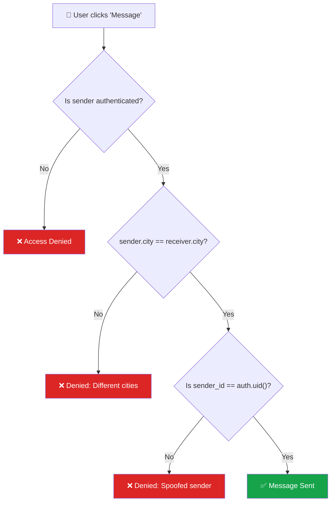

# Permission Matrix — Tayaq.ai

## Role-Based Access Control (RBAC)

| Table | User (Read) | User (Write) | Admin (Read) | Admin (Write) |
|---|---|---|---|---|
| **profiles** | ✅ All profiles (for leaderboard & community) | ✅ Own profile only | ✅ All profiles | ✅ All profiles |
| **messages** | ✅ Own messages (sender or receiver) | ✅ Insert as sender; Update read status as receiver | ✅ All messages | ✅ All messages |
| **chat_sessions** | ✅ Own sessions only | ✅ Create & update own sessions | ✅ All sessions | ✅ All sessions |
| **audit_log** | ❌ No access | ❌ No access | ✅ All logs | ✅ Insert only (via service role) |
| **daily_stats** | ✅ All stats (public dashboard) | ❌ No access | ✅ All stats | ✅ Insert & update (via service role) |

---

## Detailed Breakdown

### 👤 User Role

| Operation | profiles | messages | chat_sessions | audit_log | daily_stats |
|---|---|---|---|---|---|
| **SELECT** | ✅ All rows | ✅ Where `sender_id = me` OR `receiver_id = me` | ✅ Where `user_id = me` | ❌ Denied | ✅ All rows |
| **INSERT** | ✅ Where `id = me` | ✅ Where `sender_id = me` | ✅ Where `user_id = me` | ❌ Denied | ❌ Denied |
| **UPDATE** | ✅ Where `id = me` | ✅ Where `receiver_id = me` (mark as read) | ✅ Where `user_id = me` | ❌ Denied | ❌ Denied |
| **DELETE** | ❌ Denied | ❌ Denied | ❌ Denied | ❌ Denied | ❌ Denied |

### 🔑 Admin Role (Service Role Key)

| Operation | profiles | messages | chat_sessions | audit_log | daily_stats |
|---|---|---|---|---|---|
| **SELECT** | ✅ All | ✅ All | ✅ All | ✅ All | ✅ All |
| **INSERT** | ✅ All | ✅ All | ✅ All | ✅ All | ✅ All |
| **UPDATE** | ✅ All | ✅ All | ✅ All | ❌ Immutable | ✅ All |
| **DELETE** | ✅ All | ✅ All | ✅ All | ❌ Immutable | ✅ All |

> **Note:** Audit log is **append-only** — even admins cannot update or delete entries. This ensures tamper-proof traceability.

---

## Implementation via Supabase RLS

```sql
-- Example: User can only read own messages
CREATE POLICY "Users can read own messages"
  ON messages FOR SELECT
  USING (auth.uid() = sender_id OR auth.uid() = receiver_id);

-- Example: User can only send messages as themselves
CREATE POLICY "Users can send messages"
  ON messages FOR INSERT
  WITH CHECK (auth.uid() = sender_id);

-- Admin bypasses RLS via service_role key (no policies needed)
```

### How roles work in Supabase:

| Role | Key Used | RLS | Access |
|---|---|---|---|
| **User** | `anon` key + JWT token | ✅ Enforced | Only rows matching policies |
| **Admin** | `service_role` key | ❌ Bypassed | Full access to all rows |

---

## ABAC Rule (Attribute-Based Access Control)

> **ABAC** goes beyond roles — access decisions are based on **attributes** of the user, resource, and environment.

### Rule: Users can only message learners in the same city

| Attribute | Type | Value |
|---|---|---|
| **Subject** | `sender.city` | The sender's city (e.g. "Almaty") |
| **Resource** | `receiver.city` | The receiver's city (e.g. "Almaty") |
| **Action** | `INSERT` on `messages` | Sending a new message |
| **Condition** | `sender.city = receiver.city` | Must match |

**Policy in plain English:**
> A user **CAN** send a message to another user **IF AND ONLY IF** the sender's `city` attribute equals the receiver's `city` attribute in the `profiles` table.

**Why?** Tayaq.ai is designed for **local meetups** — students should only connect with nearby learners they can actually meet in real life.

### SQL Implementation (Supabase RLS)

```sql
-- ABAC: Users can only message learners in the same city
CREATE POLICY "Same city messaging"
  ON messages FOR INSERT
  WITH CHECK (
    auth.uid() = sender_id
    AND (
      SELECT p1.city FROM profiles p1 WHERE p1.id = auth.uid()
    ) = (
      SELECT p2.city FROM profiles p2 WHERE p2.id = receiver_id
    )
  );
```

### ABAC Evaluation Flow



### RBAC vs ABAC Comparison

| Aspect | RBAC (Role-Based) | ABAC (Attribute-Based) |
|---|---|---|
| **Decision based on** | User's role (User / Admin) | User's attributes (city, streak, etc.) |
| **Example** | "Users can read own messages" | "Users can message only same-city learners" |
| **Granularity** | Coarse (role-level) | Fine (attribute-level) |
| **Our usage** | 5 tables × 2 roles | 1 rule on `messages.INSERT` |
