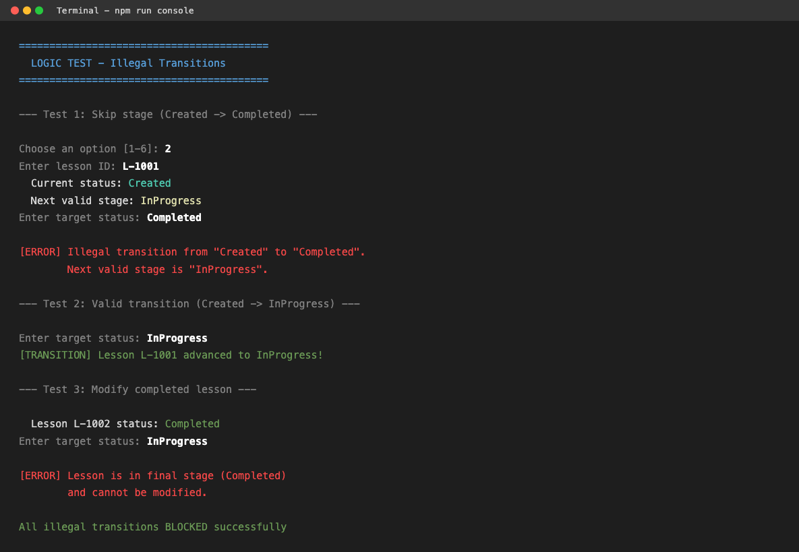
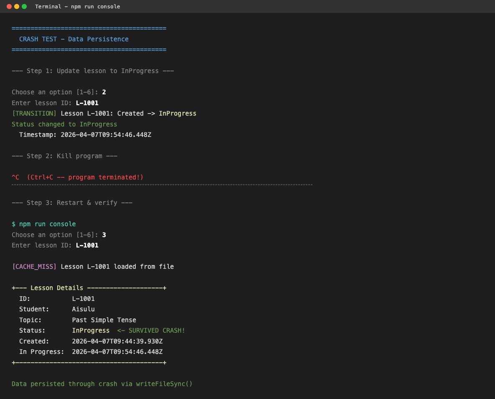

# Tayaq.ai
> The first hyper-localized AI language coach with "High-Accountability Edutainment" for the Kazakh youth market.

## Problem Statement
Traditional English learning in Kazakhstan is stuck in the "London is the capital of Great Britain" era—it is sterile, academic, and completely disconnected from the digital culture of Kazakh youth. Current apps are too polite; they don't provide the high-stakes accountability or the bold humor that local learners actually find motivating. Because these platforms lack local flavor and "Уятай" energy, young Kazakhs lose interest within the first week, leading to a massive waste of time and a "fluency plateau". Tayaq.ai solves this by providing a mentor that feels like a funny friend or a strict but humorous coach to keep Gen Z and Millennial learners engaged and consistent.

## Features
- **High-Accountability Edutainment:** Moves away from passive learning to an engaging, interactive, and fast-paced experience.
- **Hyper-Localized Persona:** A bold, charismatic, and humorous AI that "roasts" users for their mistakes using modern Kazakh memes, the "Уятай" subculture, and relatable «Шала Қазақ» humor.
- **Targeted for Digital Natives:** Tailored for Gen Z and Millennials who are highly active on social media (TikTok, Instagram, Telegram) and are tired of boring, generic language learning.

## Installation Steps
1. Clone the repository and navigate to the project directory:
   ```bash
   git clone https://github.com/zhuaman0/tayaq.ai.git
   cd tayaq.ai
   ```
2. Install the necessary dependencies:
   ```bash
   npm install
   ```

## Usage Instructions
- **Start the Nuxt Web Application:**
  ```bash
  npm run dev
  ```
  The development server will start on `http://localhost:3000`.

- **Run the Console Application:**
  ```bash
  npm run console
  ```
  This will launch the Node.js console application located in `console-app/index.js`.

## Screenshots
Here is a preview of the application logic testing in action:


<br>


## Technology Stack
- **Frontend Framework:** [Nuxt.js](https://nuxt.com/) (powered by Vue 3)
- **Styling:** [TailwindCSS](https://tailwindcss.com/)
- **AI Integration:** [OpenAI SDK](https://github.com/openai/openai-node)
- **Runtime/Backend:** Node.js
