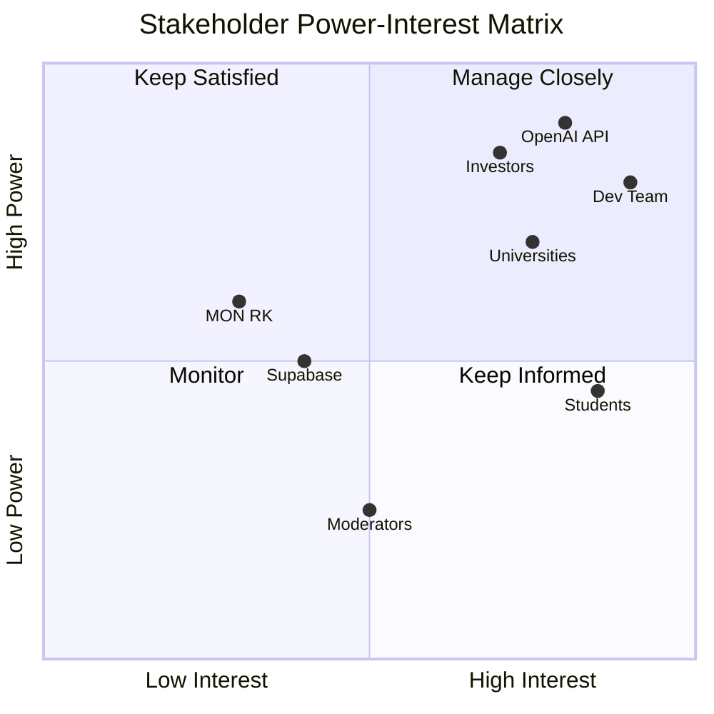

# Слайд 6: System Framing & Stakeholders

## Выбранный домен

**EdTech (Образовательные технологии)** — AI-powered language learning platform

Tayaq.ai — это платформа для изучения английского языка с использованием AI-тьютора, голосового интерфейса (STT → LLM → TTS), и геопространственной индексации (H3) для объединения учеников в реальной жизни.

---

## Критический сценарий сбоя

> **Сценарий:** Отказ AI-сервиса (OpenAI API) во время голосовой сессии обучения

**Что происходит:**
1. Ученик начинает голосовую сессию с AI-тьютором Tayaq.ai
2. Речь ученика конвертируется в текст (STT) → отправляется в OpenAI GPT-4o
3. **OpenAI API возвращает ошибку 503 (Service Unavailable)** или timeout
4. Ученик не получает обратную связь по ошибкам в грамматике
5. XP не начисляется, streak может потеряться
6. Ученик теряет доверие к платформе

**Последствия:**

| Влияние | Описание |
|---|---|
| 🔴 Потеря пользователей | Ученики уходят к конкурентам |
| 🟡 Потеря данных сессии | Незавершённая сессия, XP не сохранён |
| 🟡 Нарушение streak | Ученик теряет мотивацию |
| 🟢 Финансовые потери | Потраченные API-токены без результата |

**Митигация:**
- Fallback на локальную модель или cached responses
- Graceful degradation: показать последний известный feedback
- Audit log фиксирует сбой для отладки
- Streak не сбрасывается при системной ошибке

---

## Таблица стейкхолдеров

| Stakeholder | Role | Power | Risk |
|---|---|---|---|
| **Ученики (студенты)** | Конечные пользователи — изучают английский через AI-тьютора, общаются с другими учениками | 🟡 Medium — могут уйти к конкурентам, влияют через отзывы | Потеря данных прогресса; утечка персональных данных; некорректная AI-обратная связь |
| **Университеты / Школы** | Партнёры — интегрируют Tayaq.ai в образовательный процесс | 🔴 High — влияют на массовое привлечение пользователей | Несоответствие контента учебным стандартам; нестабильность платформы |
| **Команда разработки** | Создатели — разрабатывают и поддерживают платформу | 🔴 High — контролируют техническую реализацию | Технический долг; burnout; потеря ключевых разработчиков |
| **OpenAI (API provider)** | Поставщик AI — предоставляет GPT-4o для генерации ответов | 🔴 High — единственный поставщик критического сервиса | Изменение цен; даунтайм API; изменение ToS; цензура контента |
| **Supabase (BaaS)** | Инфраструктура — хостинг БД, аутентификация, хранилище | 🟡 Medium — можно мигрировать на альтернативу | Даунтайм; потеря данных; изменение лимитов бесплатного плана |
| **Инвесторы** | Финансирование — обеспечивают ресурсы для развития | 🔴 High — влияют на стратегические решения | Недостаточная монетизация; отсутствие product-market fit |
| **МОН РК (Министерство образования)** | Регулятор — устанавливает образовательные стандарты | 🟡 Medium — может потребовать сертификацию | Несоответствие нормативам; блокировка контента |
| **Модераторы контента** | Безопасность — следят за сообщениями в community | 🟢 Low — можно автоматизировать | Пропуск оскорбительного контента; ложные срабатывания |

---

## Матрица Power / Interest

